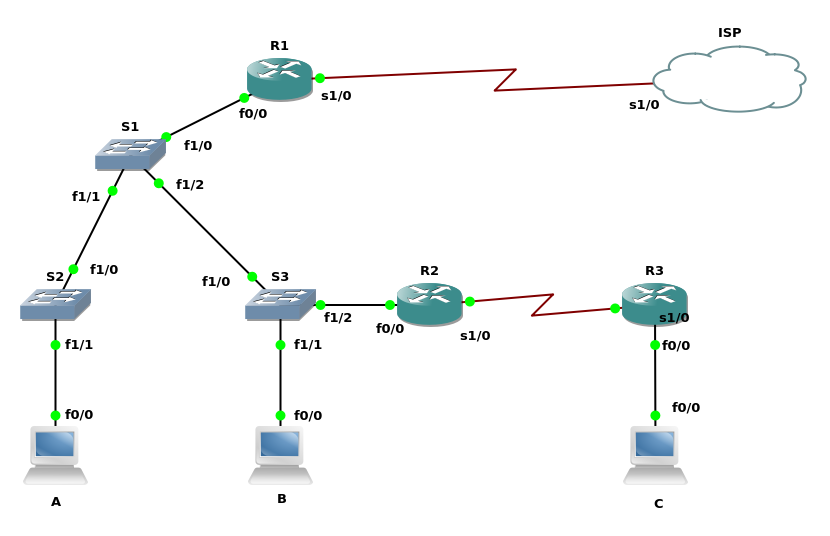
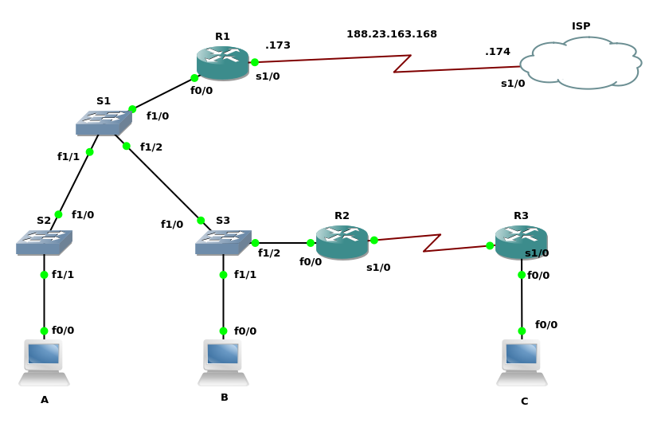
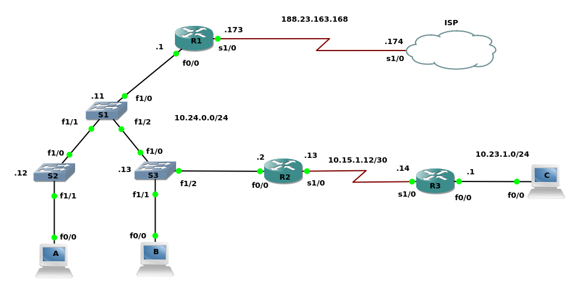
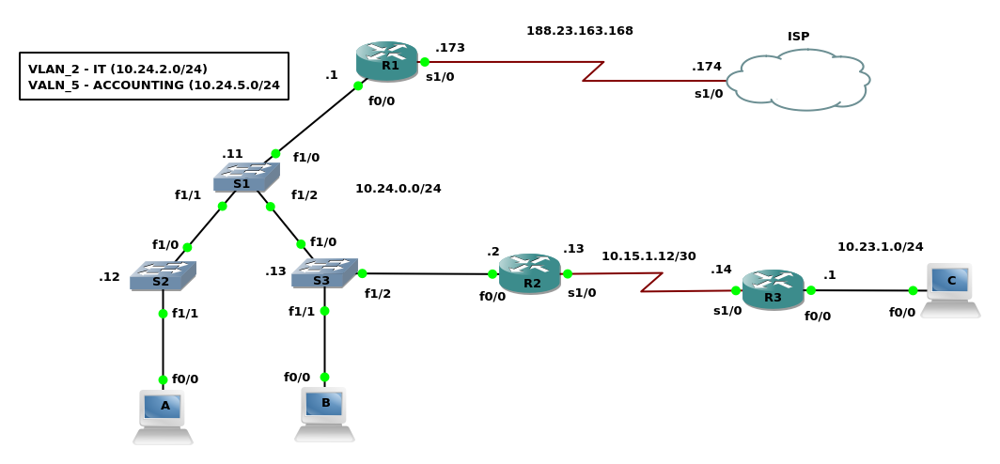
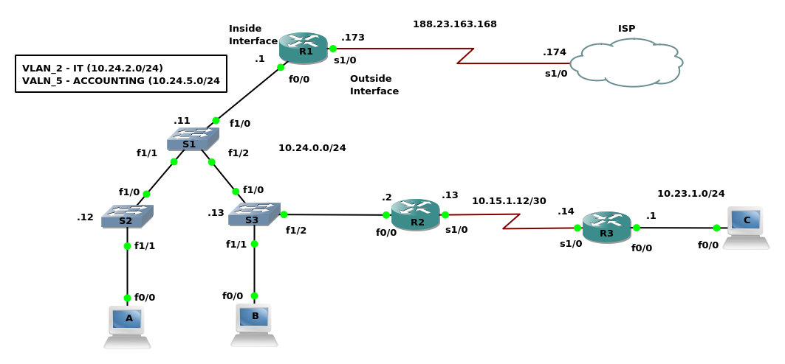

# Cisco CCNA ICND2 200-105

## Welcome to ICND2

* Course Overview
  * Cisco's Mission
    * Move you to the Wide Are network
    * PPP
    * PPPoE
  * Content You'll Cover
    * Routing
      * OSPF
      * EIGRP
      * BGP
      * HSRP
      * SNMP
      * IP SLA
* Supplementary Files
  * GNS3
* Getting the most from this series
  * Repetition, Repetition, Repetition
  * Take Notes; Write Down Key Information you hear
  * Build a lab or GNs3/VIRL Away
  * Study Hard
  * Dig Deeper
  * "Fall" In Love

## Review Lab

### Rebuilding ICND 1

* Understanding the Rebuilding Lab
  * Building the Topology in GNS3
    * Drop 4 Routers
      * Configuration
        * ISP symbol = Cloud
        * ISP, R1, R2, R3 Slot 1 = NM-4t
    * Drop 3 Routers
      * Configuration
        * S1, S2, S3 Slot 1 NM-16ESW
        * Change Symbol to ethernet-switch
    * Drop 3 Routers
      * Configuration
        * A, B, C
        * Change Symbol to Computer
    * Route Cables Per the Scenario Parameters
    * 

### Step 1: Base Config

* Deploying the Base Configuration
  * ```text
    hostname R1
    line vty 0 4
      password NuggetLove
      login
      exit
      line console 0
        password NuggetLove
        login
        logging synchronous
        no exec-timeout
        exit
      enable secret cisco
      no ip domian-lookup
      banner motd %
        ********************
           DO NOT LOGIN IN
        ********************
        YOUR CHAIR WILL SINK
        IN QUICKSAND QUICKLY
        ********************

        %
    exit
    wr mem
    ```
  * Make your edits, and copy and past into the proper device.
  * 

### Step 2: IP Addressing, Speed, and Duplex

* Configure Router and Switches IP Addresses
  * ```text
    Config template
    Router 1
    int s1/0
      no shutdown
      ip address 188.23.163.173 255.255.255.248
      exit
    int f0/0
      no shutdown
      ip address 10.24.0.1 255.255.255.0
      exit
    ISP
    int s1/0
      no shutdown
      ip address 188.23.163.174 255.255.255.248
      exit
    Router 2
      int f0/0
        no shutdown
        ip address 10.24.0.2 255.255.255.0
        exit
      int s1/0
        ip address 10.15.1.13 255.255.255.252
        no shutdown
        exit
    Router 3
      int s1/0
        no shutdown
        ip address  10.15.1.14 255.255.255.252
        exit
      int f0/0
        ip address 10.23.1.0 255.255.255.0
    Switch 1
      int vlan 1
        no shutdown
        ip address 10.24.0.11 255.255.255.0
        exit
    Switch 2
      int vlan 1
        no shutdown
        ip address 10.24.0.12 255.255.255.0
        exit
    Switch 3
      int vlan 1
        no shutdown
        ip address 10.24.0.13 255.255.255.0
        exit
    ```
  * Configure the Speed, and Duplex for local office
    * ```text
      int f0/0
        speed 100
        duplex full
      ```
  * 

### Step 3: Enabling RIPv2 Routing

* Configure RIPv2 through the Network Environment
* ```text
  Router 1 Config
    sh ip int br
    conf t
      router rip
        version 2
        no auto-summary
        network 10.0.0.0
  Router 2
    sh ip int br
    conf t
      router rip
        version 2
        no auto-summary
        network 10.0.0.0
  Router 3
    sh ip int br
      conf t
        routing rip
          version 2
          no suto-summary
          network 10.0.0.0
          passive-int f0/0

          | Alternative way to turn off RIP Routing on the interfaces
          | Cisco Prefered Method, It tends to be more secure
          | passive-interface default
          | no passive-interface s1/0
  Switches
    conf t
      ip default-gateway 10.24.0.1
      no ip routing | Must be done since these are routers with EtherSwitch Modules
    ```
  * At this point, you should be able to ping any device from anywhere in the Network.

### Step 4: Static Routes, Default Routes

* Configure Default Routes through the network environment
* ```text
  Router 1
    sh ip int br
    conf t
      ip route 0.0.0.0 0.0.0.0 188.23.163.174
      exit
    sh ip route
  ISP
    sh ip int br
    conf t
      int l0
        ip address 4.2.2.2 255.255.255.255
        exit
      int l1
        ip address 8.8.8.8 255.255.255.255
        exit
  Router 2 (Static Route)
    conf t
      ip route 0.0.0.0 0.0.0.0 10.24.0.1
      exit
  Router 1 (RIP)
    conf t
      router rip
        default-information originate
    ```
* 255.255.255.255 represents a host interface

### Step 5: Trunking, VTP, and VLANs

* Configure interwitch trunk links and user VLANs.
* Trunk Configuration
  * ```text
    Switch 1
      sh cdp neighbors
      sh int f1/1 switchport
      conf t
        int f1/1
          switchport mode trunk
          exit
        int f1/2
          switchport mode trunk
          exit
        exit
    Switch 2
      conf t
        int f1/0
          switchport mode trunk
          end
    Switch 3
      conf t
        int f1/0
          switchport mode trunk
          end
      ```
* VLAN Configuration
  * ```text
    Switch 1
      sh vtp status
      conf t
        vtp domain CBTNUGGETS
        vtp mode transparent
      vlan database
        vlan 2 name IT
        vlan 5 name ACCOUNTING
        exit
      sh vlan-switch
      sh vtp status
      conf t
        int f1/1 - 2
          switchport trunk allowed vlan 1-2,5,1002-1005
          exit
        exit
    Switch 2
      conf t
        int f1/0
          switchport trunk allowed vlan 1-2,5,1002-1005
          end
    Switch 3
      conf t
        int f1/0
          switchport trunk allowed vlan 1-2,5,1002-1005
          end
    ```
  * VLAN database: This has been deprecated, however is the only way to add VLANs in GNS3
  * FLASH Disk needs to be added to the switches for them to work properly
    * Right Click
      * Configure
      * Select the group
        * Memories and disks
          * PCMCIA Size :4Mb
* 

### Step 6: Router on a stick and DHCP services

* Configure Router on a Stick and Router DHCP Services
  * ```text
    Switch 1
      conf t
        int f1/0
          switch mode trunk
          exit
    Router 1
      conf t
        int f0/0.2
          encapsulation dot1q 2
          ip address 10.24.2.1 255.255.255.0
          exit
        int f0/0.5
          encapsulation dot1q 5
          ip address 10.24.5.1 255.255.255.0
          exit
        ip dhcp excluded-address 10.24.2.1 10.24.2.99
        ip dhcp excluded-address 10.24.2.151 10.24.2.255
        ip dhcp excluded-address 10.24.5.1 10.24.5.99
        ip dhcp excluded-address 10.24.5.151 10.24.5.255
        ip dhcp pool IT
          network 10.24.2.0 /24
          dns-server 4.2.2.2 8.8.8.8
          default-router 10.24.2.1
          exit
        do sh run | section dhcp
        ip dhcp pool ACCOUNTING
          network 10.24.5.0 /24
          dns-server 4.2.2.2 8.8.8.8
          default-router 10.24.5.1
          exit
        do sh run | section dhcp
    ```
  * Hook PCs to network
    * ```text
      PC A
        conf t
          no ip routing
          int f0/0
            no shut
            ip address dhcp
      PC-B
        conf t
          no ip routing
          int f0/0
            no shut
            ip address dhcp
      Switch 2
        conf t
          int f1/1
            switchport mode access
            switchport access vlan 2
      Switch 3
        conf t
          int f1/1
            switchport mode access
            switchport access vlan 5
      ```
  * sh ip dhcp binding

### Step 7: Network Address Translation

* Configure Network Address Translation
  * Add More memory to Router 1
    * right click
    * configure
      * memory and disk
      * RAM = 256
  * ```text
    Router 1
      sh ip int br
      conf t
        int s1/0
          ip nat outside
          exit
        do sh ip int br
        int f0/0
          ip nat inside
        int f0/0.2
          ip nat inside
        int f0/0.5
          ip nat inside
          exit
        ip access-list standard NATTABLE
          permit 10.24.0.0 0.0.0.255
          permit 10.24.2.0 0.0.0.255
          permit 10.24.5.0 0.0.0.255
          exit
        ip nat inside source list NATTABLE interface s1/0 overload
    ```
  * sh ip nat translations
* 