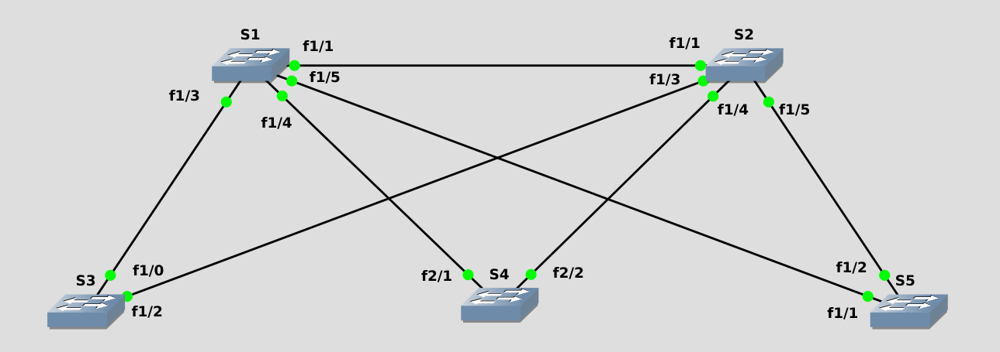
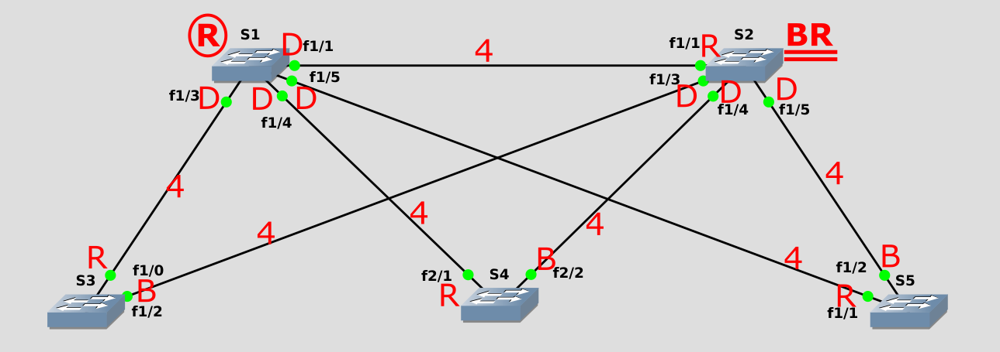

# Cisco CCNA ICND2 200-105

## Welcome to ICND2

* Course Overview
  * Cisco's Mission
    * Move you to the Wide Are network
    * PPP
    * PPPoE
  * Content You'll Cover
    * Routing
      * OSPF
      * EIGRP
      * BGP
      * HSRP
      * SNMP
      * IP SLA
* Supplementary Files
  * GNS3
* Getting the most from this series
  * Repetition, Repetition, Repetition
  * Take Notes; Write Down Key Information you hear
  * Build a lab or GNs3/VIRL Away
  * Study Hard
  * Dig Deeper
  * "Fall" In Love

## Review Lab

### Rebuilding ICND 1

* Understanding the Rebuilding Lab
  * Building the Topology in GNS3
    * Drop 4 Routers
      * Configuration
        * ISP symbol = Cloud
        * ISP, R1, R2, R3 Slot 1 = NM-4t
    * Drop 3 Routers
      * Configuration
        * S1, S2, S3 Slot 1 NM-16ESW
        * Change Symbol to ethernet-switch
    * Drop 3 Routers
      * Configuration
        * A, B, C
        * Change Symbol to Computer
    * Route Cables Per the Scenario Parameters
    * 

### Step 1: Base Config

* Deploying the Base Configuration
  * ```text
    hostname R1
    line vty 0 4
      password NuggetLove
      login
      exit
      line console 0
        password NuggetLove
        login
        logging synchronous
        no exec-timeout
        exit
      enable secret cisco
      no ip domian-lookup
      banner motd %
        ********************
           DO NOT LOGIN IN
        ********************
        YOUR CHAIR WILL SINK
        IN QUICKSAND QUICKLY
        ********************

        %
    exit
    wr mem
    ```
  * Make your edits, and copy and past into the proper device.
  * 

### Step 2: IP Addressing, Speed, and Duplex

* Configure Router and Switches IP Addresses
  * ```text
    Config template
    Router 1
    int s1/0
      no shutdown
      ip address 188.23.163.173 255.255.255.248
      exit
    int f0/0
      no shutdown
      ip address 10.24.0.1 255.255.255.0
      exit
    ISP
    int s1/0
      no shutdown
      ip address 188.23.163.174 255.255.255.248
      exit
    Router 2
      int f0/0
        no shutdown
        ip address 10.24.0.2 255.255.255.0
        exit
      int s1/0
        ip address 10.15.1.13 255.255.255.252
        no shutdown
        exit
    Router 3
      int s1/0
        no shutdown
        ip address  10.15.1.14 255.255.255.252
        exit
      int f0/0
        ip address 10.23.1.0 255.255.255.0
    Switch 1
      int vlan 1
        no shutdown
        ip address 10.24.0.11 255.255.255.0
        exit
    Switch 2
      int vlan 1
        no shutdown
        ip address 10.24.0.12 255.255.255.0
        exit
    Switch 3
      int vlan 1
        no shutdown
        ip address 10.24.0.13 255.255.255.0
        exit
    ```
  * Configure the Speed, and Duplex for local office
    * ```text
      int f0/0
        speed 100
        duplex full
      ```
  * 

### Step 3: Enabling RIPv2 Routing

* Configure RIPv2 through the Network Environment
* ```text
  Router 1 Config
    sh ip int br
    conf t
      router rip
        version 2
        no auto-summary
        network 10.0.0.0
  Router 2
    sh ip int br
    conf t
      router rip
        version 2
        no auto-summary
        network 10.0.0.0
  Router 3
    sh ip int br
      conf t
        routing rip
          version 2
          no suto-summary
          network 10.0.0.0
          passive-int f0/0

          | Alternative way to turn off RIP Routing on the interfaces
          | Cisco Prefered Method, It tends to be more secure
          | passive-interface default
          | no passive-interface s1/0
  Switches
    conf t
      ip default-gateway 10.24.0.1
      no ip routing | Must be done since these are routers with EtherSwitch Modules
    ```
  * At this point, you should be able to ping any device from anywhere in the Network.

### Step 4: Static Routes, Default Routes

* Configure Default Routes through the network environment
* ```text
  Router 1
    sh ip int br
    conf t
      ip route 0.0.0.0 0.0.0.0 188.23.163.174
      exit
    sh ip route
  ISP
    sh ip int br
    conf t
      int l0
        ip address 4.2.2.2 255.255.255.255
        exit
      int l1
        ip address 8.8.8.8 255.255.255.255
        exit
  Router 2 (Static Route)
    conf t
      ip route 0.0.0.0 0.0.0.0 10.24.0.1
      exit
  Router 1 (RIP)
    conf t
      router rip
        default-information originate
    ```
* 255.255.255.255 represents a host interface

### Step 5: Trunking, VTP, and VLANs

* Configure interwitch trunk links and user VLANs.
* Trunk Configuration
  * ```text
    Switch 1
      sh cdp neighbors
      sh int f1/1 switchport
      conf t
        int f1/1
          switchport mode trunk
          exit
        int f1/2
          switchport mode trunk
          exit
        exit
    Switch 2
      conf t
        int f1/0
          switchport mode trunk
          end
    Switch 3
      conf t
        int f1/0
          switchport mode trunk
          end
      ```
* VLAN Configuration
  * ```text
    Switch 1
      sh vtp status
      conf t
        vtp domain CBTNUGGETS
        vtp mode transparent
      vlan database
        vlan 2 name IT
        vlan 5 name ACCOUNTING
        exit
      sh vlan-switch
      sh vtp status
      conf t
        int f1/1 - 2
          switchport trunk allowed vlan 1-2,5,1002-1005
          exit
        exit
    Switch 2
      conf t
        int f1/0
          switchport trunk allowed vlan 1-2,5,1002-1005
          end
    Switch 3
      conf t
        int f1/0
          switchport trunk allowed vlan 1-2,5,1002-1005
          end
    ```
  * VLAN database: This has been deprecated, however is the only way to add VLANs in GNS3
  * FLASH Disk needs to be added to the switches for them to work properly
    * Right Click
      * Configure
      * Select the group
        * Memories and disks
          * PCMCIA Size :4Mb
* 

### Step 6: Router on a stick and DHCP services

* Configure Router on a Stick and Router DHCP Services
  * ```text
    Switch 1
      conf t
        int f1/0
          switch mode trunk
          exit
    Router 1
      conf t
        int f0/0.2
          encapsulation dot1q 2
          ip address 10.24.2.1 255.255.255.0
          exit
        int f0/0.5
          encapsulation dot1q 5
          ip address 10.24.5.1 255.255.255.0
          exit
        ip dhcp excluded-address 10.24.2.1 10.24.2.99
        ip dhcp excluded-address 10.24.2.151 10.24.2.255
        ip dhcp excluded-address 10.24.5.1 10.24.5.99
        ip dhcp excluded-address 10.24.5.151 10.24.5.255
        ip dhcp pool IT
          network 10.24.2.0 /24
          dns-server 4.2.2.2 8.8.8.8
          default-router 10.24.2.1
          exit
        do sh run | section dhcp
        ip dhcp pool ACCOUNTING
          network 10.24.5.0 /24
          dns-server 4.2.2.2 8.8.8.8
          default-router 10.24.5.1
          exit
        do sh run | section dhcp
    ```
  * Hook PCs to network
    * ```text
      PC A
        conf t
          no ip routing
          int f0/0
            no shut
            ip address dhcp
      PC-B
        conf t
          no ip routing
          int f0/0
            no shut
            ip address dhcp
      Switch 2
        conf t
          int f1/1
            switchport mode access
            switchport access vlan 2
      Switch 3
        conf t
          int f1/1
            switchport mode access
            switchport access vlan 5
      ```
  * sh ip dhcp binding

### Step 7: Network Address Translation

* Configure Network Address Translation
  * Add More memory to Router 1
    * right click
    * configure
      * memory and disk
      * RAM = 256
  * ```text
    Router 1
      sh ip int br
      conf t
        int s1/0
          ip nat outside
          exit
        do sh ip int br
        int f0/0
          ip nat inside
        int f0/0.2
          ip nat inside
        int f0/0.5
          ip nat inside
          exit
        ip access-list standard NATTABLE
          permit 10.24.0.0 0.0.0.255
          permit 10.24.2.0 0.0.0.255
          permit 10.24.5.0 0.0.0.255
          exit
        ip nat inside source list NATTABLE interface s1/0 overload
    ```
  * sh ip nat translations
* 

### Step 8: Standard Access Lists

* Configure a Standard Access list for security
* ```text
  Router 2
    conf t
      ip access-list standard LIMIT_TELNET
        permit 10.0.0.0 0.255.255.255
        deny any
      line vty 0 4
        access-class LIMIT_TELNET in
    ```
* Copy and past those commands to the other switches, and test telnet using Router 1 Serial 1/0 interface. `telnet 10.24.0.2 /source-interface serial 1/0`

## Rebuilding ICND 1 Conclusion

* At this point the top level overview review from ICND 1 has been completed. From this point forward all material discussed will be directly related to ICND 2. All review configs can be found [here](../ICND\ 1\ Review\ Configs).

## Spanning Tree Protocol

### What Does STP Do

* STP Technology Overview
  * Fact: Redundancy is Good!
    * Single Switch Connections mean single point of failure
    * Simple to create redundant links
    * Spanning tree loop
    * 
      * Layered Approach allows for easy, manageable growth
      * Etherchannel can provide more bandwidth on key links
      * Redundant connections eliminate a single point of failure
* What is the Root Bridge?
* How does STP find the best way around?
   1. Elect the Root
   2. Find the best path to the root
      * Lowest Cost
        Link Bandwidth | Cost
        :--- | ---
        10Mbps | 100
        100 Mbps | 19
        1Gbps | 4
        10Gbps | 1
      * Lowest bridge id
        * Priority Number
      * Lowest Port Number
   3. Block whatever is left over

### Understanding the Standards

* Common Spanning Tree (CST or STP - 802.1d)
  * Created in 1993
  * takes 30-50 seconds to remove the block, and rebuild the connectivity
  * time based
* Per-VLOAN Spanning Tree (PVST)
  * Cisco Proprietary
* Rapid Spanning Tree (RSTP - 802.1w)
  * Takes 2 seconds to remove the block
  * activity based
  * Will inter operate with Common Spanning tree.
* Per-VLAN Rapid Spanning Tree (PVRST)
  * Cisco Proprietary
* Multiple Spanning Tree Protocol (MSTP - 802.1s)
  * Took the Cisco Proprietary and improved upon it as an industry standard.

### How the Root Bridge is Elected

* The most important switch...EVA!
  * Two Elements:
    * Bridge Priority
      * 0-65535
      * 32768 is default
    * Bridge MAC
      * Switches own MAC address
  * ...Combined into one:
    * Bridge ID
      * Made of the Priority and MAC address combined
      * The lower the bridge ID, the better the chance of it becoming Root Bridge
        * Sample Bridge IDs:
          * 32768.00A0.1101.B011
          * 32768.00A0.FF01.6689
          * 32768.0010.FF32.991B
* Terminology: Bridge Priority, MAC, ID, BPDU
  * `show spanning-tree`
    * Root ID
    * Bridge ID
      * shows sys-id-ext which adds up to the number of VLANs you have
    * Root Bridge in the Cisco Three-Tier hierarchy should be on the Distribution Layer, where one switch is set to Primary, and the other as secondary/backup
      * Primary Switch 4096
      * Backup Switch 8192
    * Access Layer stays at Default
    * `spanning-tree vlan 1 priority 4096`
* Following the BPDU Process

### Will the Real Network Topology Step Forward

* How to determine your network topology
  * 
    * Lower left switch is our root bridge
    * All switches have a cost of 4
    * 
    * 1 Designated Port, there can never be 2 Designated Port
      * 1 side is the Root Port, the other side is Designated port
      * Only one side of the connection gets blocked thus disabling the link

### Lab - Build, Configure, Test

* Connecting the topology and discovering the root bridge in a random network
  * 
* Questions
    1. Ensure switches have a basic base configuration and connect as shown
    2. Use the proper show commands to determine the version of `STP running`, `port status`, and `identify` the `Root Bridge`
        1. STP Version
           * ieee
           * 802.1d
        2. Port Status
           * Altn - blocks connection out of switch
           * Desg - allows traffic to forward through the switch
           * Root - Port which the device uses to send traffic to the root bridge, not necessary connected to the root bridge
        3. Root Bridge
           * SW5 is the root bridge
    3. Cause a Root Port outage; determin how long it takes to converge
        1. 30 Seconds
            1. STP - Listen (15 Seconds)
               * listening for BPDU
            2. STP - Learn (15 Seconds)
               * learning mac addresses so it could learn what the nework looked like
    4. Change all switches to use RSTP test the outage again
        1. 2 Seconds
            * Unlike Spanning tree which is passive, Rapid Spanning-tree is active, so it doesn't wait for the Listening and Learning Timers to exprie.
    5. Modify the bridge priority to elect SW1 as the Root Bridge, SW2 as the Backup Root: diagram port results and verify your assumptions are correct on the switch
        1. 
* Intentionally selecting the root bridge
* Verifying what you should know to be true

#### Investigation and Configuration

* Switch 1
  * ```text
    SW1#sh spanning-tree
  
    VLAN0001
      Spanning tree enabled protocol ieee
      Root ID    Priority    32769
                Address     3c5e.c387.c280
                Cost        4
                Port        5 (GigabitEthernet1/0/5)
                Hello Time   2 sec  Max Age 20 sec  Forward Delay 15 sec

      Bridge ID  Priority    32769  (priority 32768 sys-id-ext 1)
                Address     689c.e211.6d00
                Hello Time   2 sec  Max Age 20 sec  Forward Delay 15 sec
                Aging Time  300 sec

    Interface           Role Sts Cost      Prio.Nbr Type
    ------------------- ---- --- --------- ----------------------------------------
    Gi1/0/1             Altn BLK 4         128.1    P2p
    Gi1/0/3             Desg FWD 4         128.3    P2p
    Gi1/0/4             Desg FWD 4         128.4    P2p
    Gi1/0/5             Root FWD 4         128.5    P2p
    ```
* Switch 2
  * ```text
    SW2#sh spanning-tree

    VLAN0001
      Spanning tree enabled protocol ieee
      Root ID    Priority    32769
                 Address     3c5e.c387.c280
                 Cost        4
                 Port        5 (GigabitEthernet1/0/5)
                 Hello Time   2 sec  Max Age 20 sec  Forward Delay 15 sec

      Bridge ID  Priority    32769  (priority 32768 sys-id-ext 1)
                 Address     544a.00a4.c000
                 Hello Time   2 sec  Max Age 20 sec  Forward Delay 15 sec
                 Aging Time  300 sec

    Interface           Role Sts Cost      Prio.Nbr Type
    ------------------- ---- --- --------- --------   --------------------------------
    Gi1/0/1             Desg FWD 4         128.1    P2p
    Gi1/0/3             Desg FWD 4         128.3    P2p
    Gi1/0/4             Desg FWD 4         128.4    P2p
    Gi1/0/5             Root FWD 4         128.5    P2p
    ```
* Commonality Between these two switchs
  * Interface 5 is the root port for both devices
* Switch 5
  * ```text
    SW5#sh spanning-tree

    VLAN0001
      Spanning tree enabled protocol ieee
      Root ID    Priority    32769
                 Address     3c5e.c387.c280
                 This bridge is the root
                 Hello Time   2 sec  Max Age 20 sec  Forward Delay 15 sec

      Bridge ID  Priority    32769  (priority 32768 sys-id-ext 1)
                 Address     3c5e.c387.c280
                 Hello Time   2 sec  Max Age 20 sec  Forward Delay 15 sec
                 Aging Time  300 sec

    Interface           Role Sts Cost      Prio.Nbr Type
    ------------------- ---- --- --------- -------- --------------------------------
    Gi1/0/1             Desg FWD 4         128.1    P2p
    Gi1/0/2             Desg FWD 4         128.2    P2p
    ```
* As Expected, SW5 was the root bridge as seen by this line from the show command.  
  * **`This bridge is the root`**
  * All ports are designated, which is the case since he is the root.
* Phases of a Root Port Outage for SW1
  * Unplug the Cable in Port 5, the current root port
  * ```text
    SW1#sh spanning-tree

    VLAN0001
      Spanning tree enabled protocol ieee
      Root ID    Priority    32769
                 Address     3c5e.c387.c280
                 Cost        8
                 Port        1 (GigabitEthernet1/0/1)
                 Hello Time   2 sec  Max Age 20 sec  Forward Delay 15 sec

      Bridge ID  Priority    32769  (priority 32768 sys-id-ext 1)
                 Address     689c.e211.6d00
                 Hello Time   2 sec  Max Age 20 sec  Forward Delay 15 sec
                 Aging Time  15  sec

    Interface           Role Sts Cost      Prio.Nbr Type
    ------------------- ---- --- --------- -------- --------------------------------
    Gi1/0/1             Root LIS 4         128.1    P2p
    Gi1/0/3             Desg FWD 4         128.3    P2p
    Gi1/0/4             Desg FWD 4         128.4    P2p

    SW1#sh spanning-tree

    VLAN0001
      Spanning tree enabled protocol ieee
      Root ID    Priority    32769
                 Address     3c5e.c387.c280
                 Cost        8
                 Port        1 (GigabitEthernet1/0/1)
                 Hello Time   2 sec  Max Age 20 sec  Forward Delay 15 sec

      Bridge ID  Priority    32769  (priority 32768 sys-id-ext 1)
                 Address     689c.e211.6d00
                 Hello Time   2 sec  Max Age 20 sec  Forward Delay 15 sec
                 Aging Time  15  sec

    Interface           Role Sts Cost      Prio.Nbr Type
    ------------------- ---- --- --------- -------- --------------------------------
    Gi1/0/1             Root LRN 4         128.1    P2p
    Gi1/0/3             Desg FWD 4         128.3    P2p
    Gi1/0/4             Desg FWD 4         128.4    P2p

    VLAN0001
      Spanning tree enabled protocol ieee
      Root ID    Priority    32769
                 Address     3c5e.c387.c280
                 Cost        8
                 Port        1 (GigabitEthernet1/0/1)
                 Hello Time   2 sec  Max Age 20 sec  Forward Delay 15 sec

      Bridge ID  Priority    32769  (priority 32768 sys-id-ext 1)
                 Address     689c.e211.6d00
                 Hello Time   2 sec  Max Age 20 sec  Forward Delay 15 sec
                 Aging Time  15  sec

    Interface           Role Sts Cost      Prio.Nbr Type
    ------------------- ---- --- --------- -------- --------------------------------
    Gi1/0/1             Root FWD 4         128.1    P2p
    Gi1/0/3             Desg FWD 4         128.3    P2p
    Gi1/0/4             Desg FWD 4         128.4    P2p
    ```
* Configure Rapid Spanning-tree
  * ```text
    conf t
      spanning-tree mode rapid-pvst
    ```
* Configure Bridge Priority
  * Switch 1
    * ```text
      conf t
        spanning-tree vlan 1 priority 4096
        exit
      SW1#sh spanning-tree

        VLAN0001
          Spanning tree enabled protocol rstp
          Root ID    Priority    4097
                     Address     689c.e211.6d00
                     This bridge is the root
                     Hello Time   2 sec  Max Age 20 sec  Forward Delay 15 sec

          Bridge ID  Priority    4097   (priority 4096 sys-id-ext 1)
                     Address     689c.e211.6d00
                     Hello Time   2 sec  Max Age 20 sec  Forward Delay 15 sec
                     Aging Time  300 sec

        Interface           Role Sts Cost      Prio.Nbr Type
        ------------------- ---- --- --------- -------- --------------------------------
        Gi1/0/1             Desg FWD 4         128.1    P2p
        Gi1/0/3             Desg FWD 4         128.3    P2p
        Gi1/0/4             Desg FWD 4         128.4    P2p
        Gi1/0/5             Desg FWD 4         128.5    P2p
      ```
  * Switch 2
    * ```text
      conf t
        spanning-tree vlan 1 priority 8192
        exit
      SW2#sh spanning-tree
  
        VLAN0001
          Spanning tree enabled protocol rstp
          Root ID    Priority    4097
                    Address     689c.e211.6d00
                    Cost        4
                    Port        1 (GigabitEthernet1/0/1)
                    Hello Time   2 sec  Max Age 20 sec  Forward Delay 15 sec
  
          Bridge ID  Priority    8193   (priority 8192 sys-id-ext 1)
                    Address     544a.00a4.c000
                    Hello Time   2 sec  Max Age 20 sec  Forward Delay 15 sec
                    Aging Time  300 sec
  
        Interface           Role Sts Cost      Prio.Nbr Type
        ------------------- ---- --- --------- -------- --------------------------------
        Gi1/0/1             Root FWD 4         128.1    P2p
        Gi1/0/3             Desg FWD 4         128.3    P2p
        Gi1/0/4             Desg FWD 4         128.4    P2p
        Gi1/0/5             Desg BLK 4         128.5    P2p
      ```
  * Switch 5 (former root bridge)
    * ```text
      SW5#sh spanning-tree

        VLAN0001
          Spanning tree enabled protocol rstp
          Root ID    Priority    4097
                     Address     689c.e211.6d00
                     Cost        4
                     Port        1 (GigabitEthernet1/0/1)
                     Hello Time   2 sec  Max Age 20 sec  Forward Delay 15 sec

          Bridge ID  Priority    32769  (priority 32768 sys-id-ext 1)
                     Address     3c5e.c387.c280
                     Hello Time   2 sec  Max Age 20 sec  Forward Delay 15 sec
                     Aging Time  300 sec

        Interface           Role Sts Cost      Prio.Nbr Type
        ------------------- ---- --- --------- -------- --------------------------------
        Gi1/0/1             Root FWD 4         128.1    P2p
        Gi1/0/2             Altn BLK 4         128.2    P2p
        ```
